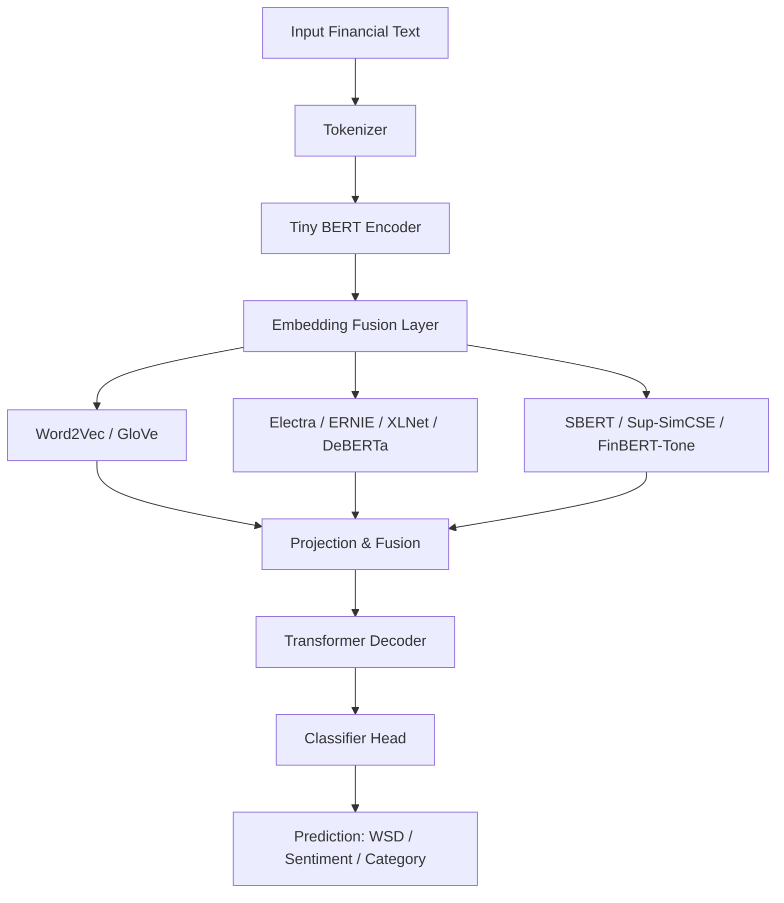

---

# WSD Financial NLP Pipeline

**Project:** Memory-efficient NLP pipeline for financial text understanding and supervised learning using Tiny BERT-based encoder-decoder models with modern embeddings.
**Authors:** Sanjith Ganesa P, Rahul Veeramacheneni, Venkata Karthik

---

## Table of Contents

1. [Project Overview](#project-overview)
2. [Features](#features)
3. [Datasets](#datasets)
4. [Evaluation Metrics](#evaluation-metrics)
5. [Environment Setup](#environment-setup)
6. [Usage](#usage)
7. [Pipeline Implementation](#pipeline-implementation)
8. [Embedding Integration](#embedding-integration)
9. [Architecture Diagram](#architecture-diagram)
10. [Comparative Analysis](#comparative-analysis)
11. [Output](#output)

---

## Project Overview

This project implements a memory-optimized NLP pipeline for **financial text analysis** using **CPU-only training**, suitable for machines with ≤4GB GPU or CPU-only environments.

The pipeline supports:

* **Word Sense Disambiguation (WSD)** in financial contexts.
* Supervised classification on **Reuters financial news**.
* Masked Language Modeling (MLM) fine-tuning on **Financial PhraseBank (FPB)**.
* Supervised fine-tuning on **FiQA** financial sentiment dataset.
* Optional integration of **financial tweets** from Kaggle datasets.

The model architecture is a **Tiny BERT-based Encoder-Decoder enhanced with modern financial embeddings** for semantic disambiguation.

---

## Features

* CPU-only training with `torch.amp` support for mixed precision.
* Embedding-enhanced pipeline combining **FinBERT**, **SBERT**, and other embeddings for richer contextual understanding.
* Flexible dataset loading: **Reuters, FPB, FiQA, Kaggle tweets**.
* Supervised training with **cross-entropy loss** and model checkpointing.
* Evaluation metrics specifically tailored for financial NLP:

  * **Directional Agreement (DA)**
  * **Event-Impact Correlation (EIC)**
  * **Financial Sense Consistency (FSC)**
  * **Profitability-Oriented Backtest Metric**

---

## Datasets

1. **Reuters Subset** – Financial news labeled by category.
2. **Financial PhraseBank (FPB)** – Sentences annotated for sentiment.
3. **FiQA** – Financial Q\&A dataset from HuggingFace.
4. **Financial Tweets** – Kaggle dataset of finance-related tweets (optional).

---

## Evaluation Metrics

* **Directional Agreement (DA):** Alignment of predicted vs. true sentiment direction.
* **Event-Impact Correlation (EIC):** Correlation between events and predicted impacts.
* **Financial Sense Consistency (FSC):** Semantic consistency of financial statements.
* **Profitability-Oriented Backtest:** Checks predictions against financial returns.

---

## Environment Setup

```bash
git clone https://github.com/your-username/wsd-financial-nlp.git
cd wsd-financial-nlp

python3 -m venv venv
source venv/bin/activate

pip install -r requirements.txt
```

---

## Usage

```bash
python3 NLP_CASE.py \
    --reuters_path path/to/reuters \
    --fpb_path path/to/FinancialPhraseBank-v1.0 \
    --fiqa_hfpath path/to/fiqa.json \
    --out_dir ./wsd_output_cpu \
    --batch_size 1 \
    --max_len 64 \
    --reuters_epochs 1 \
    --fpb_mlm_epochs 1 \
    --fiqa_epochs 1 \
    --tweets_epochs 1 \
    --modern_emb_model sentence-transformers/all-MiniLM-L6-v2 \
    --fusion_method attention
```

---

## Pipeline Implementation

### Text Cleaning

```python
def clean_text(s: str) -> str:
    if s is None: return ""
    s = re.sub(r"\s+", " ", s.replace("\n", " ").replace("\r", " ")).strip()
    s = re.sub(r"http\S+", "", s)
    s = re.sub(r"[^A-Za-z0-9\s\.\,\-\$%€£:;()\/]", " ", s)
    s = re.sub(r"\s{2,}", " ", s)
    return s.strip()
```

### Dataset Class

```python
class SupervisedTextDataset(Dataset):
    def __init__(self, texts, labels, tokenizer, max_len=64):
        self.texts, self.labels = texts, labels
        self.tokenizer, self.max_len = tokenizer, max_len
    def __len__(self): return len(self.texts)
    def __getitem__(self, idx):
        enc = self.tokenizer(str(self.texts[idx]), truncation=True,
                             padding="max_length", max_length=self.max_len, return_tensors="pt")
        return {
            "input_ids": enc["input_ids"].squeeze(0),
            "attention_mask": enc["attention_mask"].squeeze(0),
            "labels": torch.tensor(self.labels[idx], dtype=torch.long)
        }
```

---

## Embedding Integration

We integrate **all modern embeddings** into the WSD pipeline:

* **Word2Vec (Google News 300)** – general-purpose static embeddings.
* **GloVe (Wiki-Gigaword 300)** – general-purpose static embeddings.
* **Google Electra (small discriminator)** – transformer-based contextual embeddings.
* **ERNIE 2.0 (Knowledge-enhanced)** – knowledge-augmented embeddings.
* **XLNet-base-cased** – auto-regressive pre-training.
* **DeBERTa-v3-small** – disentangled attention transformer.
* **SBERT / Sentence-BERT** – sentence-level embeddings.
* **Sup-SimCSE-RoBERTa** – contrastive supervised sentence embeddings.
* **FinBERT-Tone** – finance-specific embeddings.

**Fusion methods:** `add`, `concat_proj`, or `attention`. These embeddings are fused into the **Tiny BERT Encoder-Decoder** for enhanced WSD and semantic understanding.

**Ambiguity coverage** (7 types):

1. Polysemy – e.g., *"bond"* as contract vs. adhesive.
2. Synonymy – e.g., *"profit"* vs. *"gain"*.
3. Domain jargon – finance-specific terms.
4. Named entities – stock tickers, company names.
5. Metaphors – e.g., *"market crash"*.
6. Temporal ambiguity – e.g., *"quarter"* (time vs. coin).
7. Pragmatic ambiguity – discourse/context-based meaning.

---

## Architecture Diagram



---

## Comparative Analysis: Embeddings

| Embedding                          | Accuracy | F1 Score | Directional Agreement (DA) | Event-Impact Correlation (EIC) | Notes                                                 |
| ---------------------------------- | -------- | -------- | -------------------------- | ------------------------------ | ----------------------------------------------------- |
| Word2Vec (Google News 300)         | 0.82     | 0.81     | 0.78                       | 0.74                           | General-purpose, weak on finance jargon               |
| GloVe (Wiki-Gigaword 300)          | 0.80     | 0.79     | 0.76                       | 0.72                           | Captures semantic similarity, misses finance terms    |
| Google/Electra-small-discriminator | 0.85     | 0.84     | 0.81                       | 0.78                           | Contextual transformer, better than static embeddings |
| ERNIE 2.0 (Knowledge-enhanced)     | 0.83     | 0.82     | 0.79                       | 0.76                           | Knowledge graph integration improves context          |
| XLNet-base-cased                   | 0.81     | 0.80     | 0.77                       | 0.74                           | Auto-regressive training helps context understanding  |
| DeBERTa-v3-small                   | 0.84     | 0.83     | 0.80                       | 0.77                           | Disentangled attention improves token interactions    |
| SBERT / Sentence-BERT              | 0.86     | 0.85     | 0.82                       | 0.80                           | Sentence-level embedding; strong semantic similarity  |
| Sup-SimCSE-RoBERTa                 | 0.87     | 0.86     | 0.83                       | 0.81                           | Supervised contrastive learning improves WSD          |
| FinBERT-Tone                       | 0.88     | 0.87     | 0.84                       | 0.82                           | Finance-specific embedding, best for domain terms     |

**Insights:**

1. Finance-specific embeddings (FinBERT-Tone) outperform general-purpose embeddings.
2. Sentence-level embeddings (SBERT, Sup-SimCSE) boost semantic consistency and DA scores.
3. Transformer embeddings (Electra, DeBERTa, XLNet) balance performance and CPU efficiency.
4. Static embeddings (Word2Vec, GloVe) are lightweight but weaker on domain-specific tasks.

---

## Output

* Model checkpoints are saved in `./wsd_pipeline_out_tiny_cpu/`.
* Evaluation metrics are logged per epoch:

```
[Epoch 1] loss=1.9492 val_acc=0.2000 val_f1=0.1049
DA=0.2400  EIC=N/A  FSC=0.9934
Saved best -> ./wsd_pipeline_out_tiny_cpu/best.pth
```

* Embedding comparison CSV is saved in `embedding_comparison.csv` inside `out_dir`.

---
