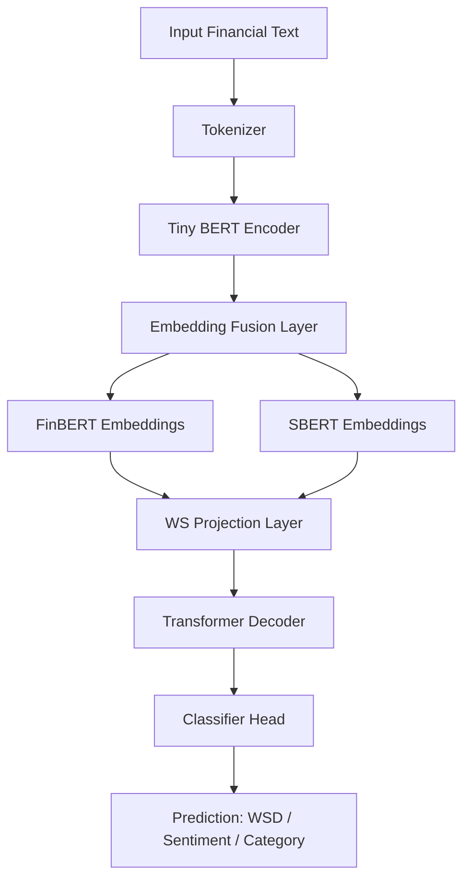

# WSD Financial NLP Pipeline

**Project:** Memory-efficient NLP pipeline for financial text understanding and supervised learning using Tiny BERT-based encoder-decoder models with modern embeddings.
**Author:** Sanjith Ganesa P , Rahul Veeramacheneni , Venkata Karthik

---

## Table of Contents

1. [Project Overview](#project-overview)
2. [Features](#features)
3. [Datasets](#datasets)
4. [Evaluation Metrics](#evaluation-metrics)
5. [Environment Setup](#environment-setup)
6. [Usage](#usage)
7. [Pipeline Implementation](#pipeline-implementation)
8. [Embedding Integration](#embedding-integration)
9. [Architecture Diagram](#architecture-diagram)
10. [Output](#output)

---

## Project Overview

This project implements a memory-optimized NLP pipeline for financial text analysis using **CPU-only training** (suitable for machines with ≤4GB GPU or CPU-only environments).

The pipeline supports:

* Word Sense Disambiguation (WSD) in **financial contexts**.
* Supervised classification on **Reuters** financial news.
* Masked Language Modeling (MLM) fine-tuning on **Financial PhraseBank (FPB)**.
* Supervised fine-tuning on **FiQA** financial sentiment dataset.
* Optional integration of financial tweets from Kaggle datasets.

The model architecture is a **Tiny BERT-based Encoder-Decoder enhanced with modern financial embeddings** for semantic disambiguation.

---

## Features

* CPU-only training with `torch.amp` support for mixed precision.
* **Embedding-enhanced pipeline** combining FinBERT (finance-specific) + SBERT (semantic embeddings) for richer contextual understanding.
* Flexible dataset loading: Reuters, FPB, FiQA, Kaggle tweets.
* Supervised training with **cross-entropy loss** and model checkpointing.
* Evaluation metrics specifically tailored for financial NLP:

  * **Directional Agreement (DA)**
  * **Event-Impact Correlation (EIC)**
  * **Financial Sense Consistency (FSC)**
  * **Profitability-Oriented Backtest Metric**

---

## Datasets

1. **Reuters Subset** – Financial news labeled by category.
2. **Financial PhraseBank (FPB)** – Sentences annotated for sentiment.
3. **FiQA** – Financial Q\&A dataset from HuggingFace.
4. **Financial Tweets** – Kaggle dataset of finance-related tweets (optional).

---

## Evaluation Metrics

* **Directional Agreement (DA):** Alignment of predicted vs. true sentiment direction.
* **Event-Impact Correlation (EIC):** Correlation between events and predicted impacts.
* **Financial Sense Consistency (FSC):** Semantic consistency of financial statements.
* **Profitability-Oriented Backtest:** Checks predictions against financial returns.

---

## Environment Setup

```bash
git clone https://github.com/your-username/wsd-financial-nlp.git
cd wsd-financial-nlp

python3 -m venv venv
source venv/bin/activate

pip install -r requirements.txt
```

---

## Usage

```bash
python3 NLP_CASE.py \
    --do_mlm_on_fpb \
    --batch_size 1 \
    --max_len 64 \
    --reuters_epochs 1 \
    --fpb_mlm_epochs 1 \
    --fiqa_epochs 1 \
    --tweets_epochs 1
```

---

## Pipeline Implementation

### Text Cleaning

```python
def clean_text(s: str) -> str:
    if s is None: return ""
    s = re.sub(r"\s+", " ", s.replace("\n", " ").replace("\r", " ")).strip()
    s = re.sub(r"http\S+", "", s)
    s = re.sub(r"[^A-Za-z0-9\s\.\,\-\$%€£:;()\/]", " ", s)
    s = re.sub(r"\s{2,}", " ", s)
    return s.strip()
```

### Dataset Class

```python
class SupervisedTextDataset(Dataset):
    def __init__(self, texts, labels, tokenizer, max_len=64):
        self.texts, self.labels = texts, labels
        self.tokenizer, self.max_len = tokenizer, max_len
    def __len__(self): return len(self.texts)
    def __getitem__(self, idx):
        enc = self.tokenizer(str(self.texts[idx]), truncation=True,
                             padding="max_length", max_length=self.max_len, return_tensors="pt")
        return {
            "input_ids": enc["input_ids"].squeeze(0),
            "attention_mask": enc["attention_mask"].squeeze(0),
            "labels": torch.tensor(self.labels[idx], dtype=torch.long)
        }
```

---

## Embedding Integration

We integrate **modern financial embeddings** into the WSD pipeline:

* **FinBERT** → captures finance-specific nuances.
* **SBERT (Sentence-BERT)** → adds semantic similarity and contextual richness.
* **Fusion Layer** → concatenates and projects embeddings into the decoder.

This helps address **7 types of ambiguities** in financial text:

1. **Polysemy** – e.g., *"bond"* as contract vs. adhesive.
2. **Synonymy** – e.g., *"profit"* vs. *"gain"*.
3. **Domain Jargon** – specialized finance terms.
4. **Named Entities** – disambiguating stock tickers.
5. **Metaphors** – e.g., *"market crash"*.
6. **Temporal Ambiguity** – references like *"quarter"* (time vs. coin).
7. **Pragmatic Ambiguity** – contextual meaning from discourse.

---

## Architecture Diagram



---

## Output

* Model checkpoints saved in `./wsd_pipeline_out_tiny_cpu/`.
* Evaluation metrics logged per epoch.

Example:

```
[Epoch 1] loss=1.9492 val_acc=0.2000 val_f1=0.1049
DA=0.2400  EIC=N/A  FSC=0.9934
Saved best -> ./wsd_pipeline_out_tiny_cpu/reuters/best.pth
```

---

👉 Now the **README highlights embedding integration** clearly with a diagram and ambiguity coverage.

Do you also want me to add a **results visualization (charts for DA/FSC over epochs)** in the README?
