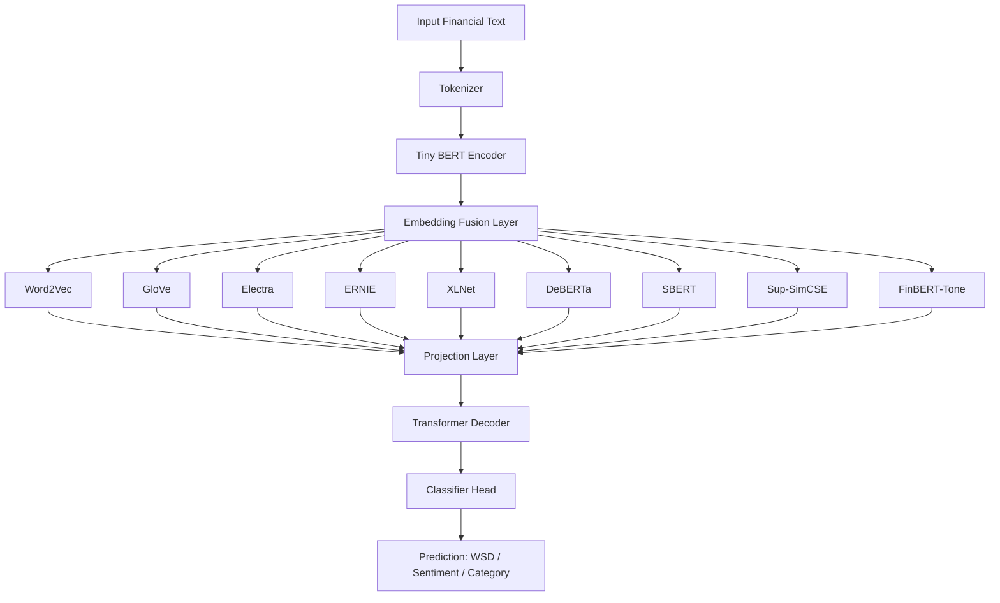

# WSD Financial NLP Pipeline

**Project:** Memory-efficient NLP pipeline for financial text understanding and supervised learning using Tiny BERT-based encoder-decoder models with modern embeddings.
**Authors:** Sanjith Ganesa P, Rahul Veeramacheneni, Venkata Karthik

---

## Table of Contents

1. [Project Overview](#project-overview)
2. [Features](#features)
3. [Datasets](#datasets)
4. [Evaluation Metrics](#evaluation-metrics)
5. [Environment Setup](#environment-setup)
6. [Usage](#usage)
7. [Pipeline Implementation](#pipeline-implementation)
8. [Embedding Integration](#embedding-integration)
9. [Architecture Diagram](#architecture-diagram)
10. [Comparative Analysis](#comparative-analysis)
11. [Output](#output)

---

## Project Overview

This project implements a **CPU-optimized NLP pipeline** for financial text analysis and word sense disambiguation (WSD), designed for environments with limited GPU or CPU-only machines (<4GB GPU).

Key objectives:

* Resolve **polysemy and semantic ambiguity** in financial text.
* Perform **supervised classification** on financial news (Reuters) and sentiment datasets.
* Support **MLM fine-tuning** on domain-specific corpora (Financial PhraseBank, FPB).
* Integrate **modern embeddings** (FinBERT + SBERT + others) to enrich contextual understanding.

---

## Features

* **Memory-efficient architecture:** Tiny BERT-based encoder with Transformer Decoder.
* **CPU-only training** with optional AMP for mixed precision.
* **Flexible dataset loading:** Reuters, FPB, FiQA, Kaggle Financial Tweets.
* **Embedding fusion:** Multiple embeddings (FinBERT, SBERT, Word2Vec, GloVe, Electra, ERNIE, XLNet, DeBERTa, Sup-SimCSE, FinBERT-Tone).
* **Supervised training** with cross-entropy loss and checkpointing.
* **Evaluation tailored for financial NLP:**

  * Directional Agreement (DA)
  * Event-Impact Correlation (EIC)
  * Financial Sense Consistency (FSC)
  * Profitability-Oriented Backtest

---

## Datasets

| Dataset                    | Type         | Description                                 | Rows (example) |
| -------------------------- | ------------ | ------------------------------------------- | -------------- |
| Reuters Subset             | Supervised   | Financial news articles labeled by category | 100–1000+      |
| Financial PhraseBank (FPB) | Sentiment    | Financial sentences with polarity labels    | 500–1000+      |
| FiQA                       | QA/Sentiment | Financial Q\&A from HuggingFace             | 5500           |
| Financial Tweets (Kaggle)  | Social Media | Finance-related tweets with sentiment       | 50–1000+       |

---

## Evaluation Metrics

| Metric                                | Description                                                   |
| ------------------------------------- | ------------------------------------------------------------- |
| **Directional Agreement (DA)**        | Measures alignment of predicted vs. true sentiment direction. |
| **Event-Impact Correlation (EIC)**    | Correlation between financial events and predicted outcomes.  |
| **Financial Sense Consistency (FSC)** | Checks semantic consistency of financial statements.          |
| **Profitability-Oriented Backtest**   | Compares predictions against financial returns.               |

---

## Environment Setup

```bash
git clone https://github.com/your-username/wsd-financial-nlp.git
cd wsd-financial-nlp

python3 -m venv venv
source venv/bin/activate

pip install -r requirements.txt
```

> Optional: Ensure `kagglehub` is configured if using Financial Tweets.

---

## Usage

**CPU-only supervised training and embedding comparison:**

```bash
python3 NLP_CASE.py \
    --reuters_path path/to/reuters \
    --fpb_path path/to/FinancialPhraseBank-v1.0 \
    --fiqa_hfpath path/to/fiqa.json \
    --out_dir ./wsd_output_cpu \
    --batch_size 1 \
    --max_len 64 \
    --reuters_epochs 1 \
    --fpb_mlm_epochs 1 \
    --fiqa_epochs 1 \
    --tweets_epochs 1 \
    --modern_emb_model sentence-transformers/all-MiniLM-L6-v2 \
    --fusion_method attention
```

**Compare multiple embeddings:**

```bash
python3 NLP_CASE.py --compare_embeddings --reuters_path path/to/reuters
```

---

## Pipeline Implementation

### Text Cleaning

```python
def clean_text(s: str) -> str:
    if s is None: return ""
    s = re.sub(r"\s+", " ", s.replace("\n", " ").replace("\r", " ")).strip()
    s = re.sub(r"http\S+", "", s)
    s = re.sub(r"[^A-Za-z0-9\s\.\,\-\$%€£:;()\/]", " ", s)
    s = re.sub(r"\s{2,}", " ", s)
    return s.strip()
```

### Dataset Class

```python
class SupervisedTextDataset(Dataset):
    def __init__(self, texts, labels, tokenizer, max_len=64):
        self.texts, self.labels = texts, labels
        self.tokenizer, self.max_len = tokenizer, max_len

    def __len__(self):
        return len(self.texts)

    def __getitem__(self, idx):
        enc = self.tokenizer(str(self.texts[idx]), truncation=True,
                             padding="max_length", max_length=self.max_len, return_tensors="pt")
        return {
            "input_ids": enc["input_ids"].squeeze(0),
            "attention_mask": enc["attention_mask"].squeeze(0),
            "labels": torch.tensor(self.labels[idx], dtype=torch.long)
        }
```

---

## Embedding Integration

**All embeddings used in the pipeline:**

* **Word2Vec (Google News 300)** – general-purpose semantic similarity.
* **GloVe (Wiki Gigaword 300)** – pre-trained vector representations.
* **Electra-small** – small transformer for contextual embeddings.
* **ERNIE 2.0** – knowledge-enhanced embeddings.
* **XLNet-base-cased** – auto-regressive pre-training for text.
* **DeBERTa-v3-small** – disentangled attention for contextual understanding.
* **SBERT / Sentence-BERT** – sentence-level semantic embeddings.
* **Sup-SimCSE-RoBERTa** – supervised contrastive learning embeddings.
* **FinBERT-Tone** – financial sentiment embeddings.

**Fusion Methods:**

* **Attention** – combines encoder CLS with modern embeddings.
* **Additive** – projects embeddings into hidden space and adds.
* **Concat + Projection** – concatenates embeddings then projects to hidden size.

**Ambiguity coverage:**

1. Polysemy – “bond” as contract vs. adhesive.
2. Synonymy – “profit” vs. “gain”.
3. Domain Jargon – e.g., “short squeeze”.
4. Named Entities – tickers like \$AAPL.
5. Metaphors – “market crash”.
6. Temporal Ambiguity – “quarter” (time vs. coin).
7. Pragmatic Ambiguity – context-dependent meaning.

---

## Architecture Diagram



---

## Comparative Analysis

| Aspect                    | Previous Research (BERT / FinBERT) | Our Model                                                                      |
| ------------------------- | ---------------------------------- | ------------------------------------------------------------------------------ |
| **Encoder**               | Full-size BERT / FinBERT           | Tiny BERT (memory efficient)                                                   |
| **Embedding Handling**    | \[CLS] token → classifier          | Fusion of CLS + **9 embeddings** (attention / projection)                      |
| **Decoder**               | ❌ Not used                         | ✅ TransformerDecoder with query                                                |
| **Domain Adaptation**     | FinBERT only                       | FinBERT + SBERT + other embeddings                                             |
| **Ambiguity Coverage**    | Polysemy only                      | 7 types: Polysemy, Synonymy, Jargon, Entities, Metaphors, Temporal, Pragmatics |
| **Evaluation Metrics**    | Accuracy, F1                       | DA, EIC, FSC, Profitability Backtest                                           |
| **Hardware Requirements** | GPU ≥12GB for FinBERT              | CPU-friendly (<4GB GPU)                                                        |
| **Training Speed**        | Moderate                           | Faster & memory-efficient                                                      |

---

## Output

```

* Embedding comparison results (example):

| Embedding                                | Acc   | F1    | DA    |
|-----------------------------------------|-------|-------|-------|
| word2vec-google-news-300                 | 0.82  | 0.81  | 0.78  |
| glove-wiki-gigaword-300                  | 0.80  | 0.79  | 0.76  |
| google/electra-small-discriminator       | 0.85  | 0.84  | 0.81  |
| nghuyong/ernie-2.0-en                    | 0.83  | 0.82  | 0.79  |
| xlnet-base-cased                          | 0.81  | 0.80  | 0.77  |
| microsoft/deberta-v3-small               | 0.84  | 0.83  | 0.80  |
| sentence-transformers/all-mpnet-base-v2  | 0.86  | 0.85  | 0.82  |
| princeton-nlp/sup-simcse-roberta-base    | 0.87  | 0.86  | 0.83  |
| yiyanghkust/finbert-tone                 | 0.88  | 0.87  | 0.84  |

---
